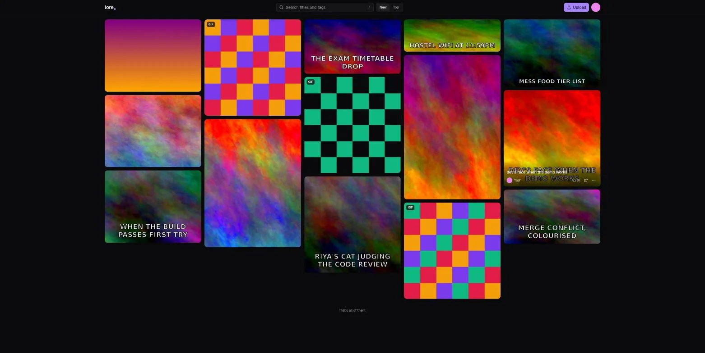

<h1 align="center">lore</h1>

<p align="center">The meme archive for your friend group. Click a meme, paste the link in Discord, it shows up as the actual image.</p>

<p align="center"><a href="docs/install.md">Set up your own</a> in about ten minutes with nothing but a Cloudflare account and a domain.</p>

---



Every friend group has a pile of images that get reposted for years. Screenshots of
someone's typo, that one reaction GIF, the photo nobody is allowed to delete. They
live scattered across chat history and camera rolls, and finding the right one at the
right moment is half the joke.

lore gives them a home. You host it, your friends upload, everyone can browse and
copy. The link you copy is the file itself, so chat apps unfurl it inline the way they
do for Tenor or Imgur. No login walls, no expiring links, no "click to view".

## How it works

**Links that render.** Each meme lives at `/i/<id>.<ext>` and is served with the
real `Content-Type`, an immutable one year cache header and no download disposition.
Discord, WhatsApp, Slack, Telegram and Twitter all treat that as an image. GIFs stay
animated because they are never re-encoded.

**Zero cost, one vendor.** A single Cloudflare Worker serves the API, the files and
the web app. Metadata is in D1, files are in R2, and hot memes are answered from
Cloudflare's edge cache without touching either. A group of twenty people with a few
thousand memes fits in the free tier with room to spare.

**No passwords.** The owner signs in with a six digit authenticator code. Friends
join through invite links that work exactly once and expire in a day. Turn on the
optional Discord login and they can get back in from any device with one click.
Visitors need nothing at all.

**Uploads that are careful with your data.** JPGs and PNGs are re-encoded in the
browser before upload, so EXIF (camera model, GPS position) never reaches the
server. Every file is checked by its magic bytes, not its extension.

## Features

- Masonry wall with animated GIFs, infinite scroll and live search over titles and tags
- Click to copy, `Enter` to copy, `o` to open, middle click for a new tab
- Sort by newest or most copied
- Drag and drop, paste from the clipboard, or pick up to 30 files at once, three uploading in parallel with progress
- Every meme shows who added it
- Optional Discord sign-in: invites can then only be claimed with a Discord account, and friends can log in on any device without a fresh invite
- Optional member mode: everyone in your Discord server can upload within a quota, new members' uploads are reviewed by an admin first, anyone can report a meme, and a ban erases everything a member posted
- Any admin can edit titles and tags or delete anything
- Owner dashboard: storage used, copy counts, top memes, top uploaders, pending invites, revoke with one click
- Dark theme by default, light theme a toggle away
- Rate limits, hashed sessions with sliding expiry, security headers, forward only migrations, tests on the parts that matter, CI that deploys on push

## Run it locally

```sh
pnpm install
pnpm migrate     # local D1
pnpm seed        # sample memes
pnpm dev         # http://localhost:5173
```

You will want a `TOTP_SECRET` in `.dev.vars` to sign in; `node scripts/setup.ts
--local-only` generates one and prints the QR code. The full setup guide, including
production deployment and GitHub Actions, is in [docs/install.md](docs/install.md).

## Stack

Cloudflare Workers, D1, R2 and the Rate Limiting binding. Hono and zod on the
server. React 19, Vite, Tailwind v4, shadcn/ui and TanStack Query on the client.
Vitest with the Workers pool for tests. pnpm workspace, oxfmt, oxlint.

## License

MIT
